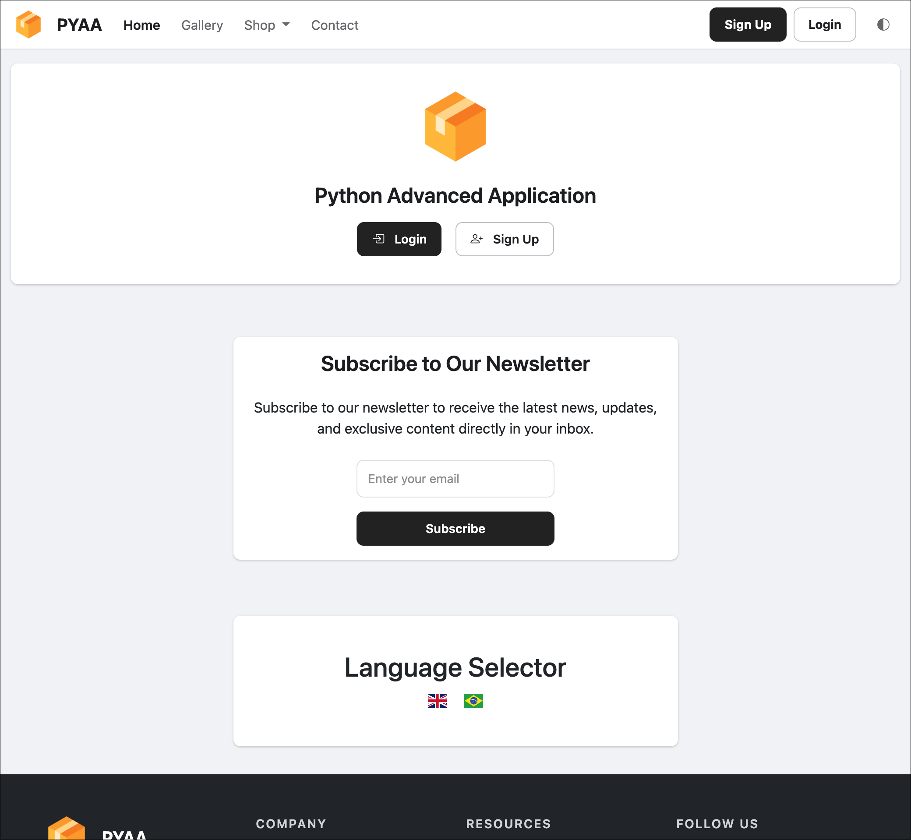

<p align="center">
    <a href="https://github.com/paulocoutinhox/pyaa" target="_blank" rel="noopener noreferrer">
        
    </a>
    <br>
    PyAA - Python Advanced Application
    <br>
</p>

PyAA is a powerful, open-source Python + Django + FastAPI + Tailwind template application designed to build robust web applications with all the essential features pre-built. Whether you need a site, an e-commerce platform, or a SaaS application, PyAA has you covered – for free!

[](https://github.com/paulocoutinhox/pyaa/actions/workflows/build.yml)

[](https://codecov.io/gh/paulocoutinhox/pyaa)

## 🚀 Features

- **Web Framework:** - Built with Django for the web application and FastAPI for high-performance REST APIs, WebSocket support, and modern async capabilities.
- **Frontend Stack:** - Powered by Tailwind CSS v4 for styling, DaisyUI as the component library, and Vite for fast asset bundling and development experience.
- **User Management** – Handle user registration, login, profile management, account recovery, configurable account activation, and more.
- **Subscription Management** – Manage user subscriptions by credits or expiration date.
- **Credit System** – Support for selling and managing user credits.
- **Checkout System** – Complete payment flow for products and services.
- **Digital Products** – Sell digital products with secure download links after purchase.
- **Banner System** – Manage banners with view and click tracking, plus detailed reporting in the admin panel.
- **Admin Panel** – A fully functional admin dashboard for managing the application.
- **Admin Reports** – Comprehensive reporting system with interactive tables and graphs for data visualization and analysis.
- **Newsletter System** – Manage newsletter subscriptions with CSV export functionality from the admin panel.
- **Theme Selector** – Support for light, dark, and auto theme modes.
- **Email Integration** – Send transactional emails with ease.
- **Recaptcha Support** – Enhance security with Recaptcha integration.
- **Image Gallery** – Manage a gallery of images efficiently.
- **Static Content Management** – Organize and manage static content across your site.
- **System Logs** – Comprehensive logging system with multiple levels (debug, info, success, warning, error) and categorization.
- **Multi-language Support** – Easily handle multiple languages.
- **Multiple Currency Support** – Process payments in different currencies.
- **Stripe Integration** – Seamlessly manage subscription payments and one-time purchases through Stripe.
- **Subscription Plans** – Control and configure different subscription tiers.
- **Background Queue** – Powered by DjangoQ with worker support for handling asynchronous tasks.
- **Status Color System** – Visual indicators for various statuses throughout the application.
- **Cached Paginator** – Optimized pagination for better performance.
- **Docker Support** – Docker configurations for web application (sync/async), workers, and cron jobs.
- **ASGI Support** – Async server deployment with Gunicorn + Uvicorn for better performance.
- **Test Coverage** – Over 50% test coverage, ensuring reliability and robustness.
- **Versatile Use** – Perfect for building websites, e-commerce platforms, or SaaS products.

## 📦 Frontend Setup

Before running the application, you need to install Node.js and npm, then install the frontend dependencies.

### Installing Node.js and npm

#### macOS

Using Homebrew:
```bash
brew install node
```

Or download the installer from [nodejs.org](https://nodejs.org/).

#### Windows

Download and run the installer from [nodejs.org](https://nodejs.org/).

Or using Chocolatey:
```bash
choco install nodejs
```

#### Linux

**Ubuntu/Debian:**
```bash
curl -fsSL https://deb.nodesource.com/setup_lts.x | sudo -E bash -
sudo apt-get install -y nodejs
```

**Fedora/RHEL:**
```bash
curl -fsSL https://rpm.nodesource.com/setup_lts.x | sudo bash -
sudo dnf install -y nodejs
```

**Arch Linux:**
```bash
sudo pacman -S nodejs npm
```

### Installing Frontend Dependencies

After installing Node.js and npm, install the project dependencies:

```bash
make frontend-setup
```

or

```bash
npm install
```

## 💻 How To Use

Execute the following commands:

```
make deps
make setup
make migrate
make create-su
make fixtures
make run
```

## 📚 Documentation

- [API](docs/api.md)
- [Async](docs/async.md)
- [Database](docs/database.md)
- [Docker](docs/docker.md)
- [Ngrok](docs/ngrok.md)
- [Production](docs/production.md)
- [Security](docs/security.md)
- [Stripe](docs/stripe.md)
- [Frontend](docs/frontend.md)
- [Troubleshooting](docs/troubleshooting.md)
- [WebApp](docs/webapp.md)
- [Cron](docs/cron.md)
- [Queue](docs/queue.md)
- [VSCode](docs/vscode.md)

## Screenshot



## 🛡️ License

[MIT](http://opensource.org/licenses/MIT)

Copyright (c) 2024-2026, Paulo Coutinho
